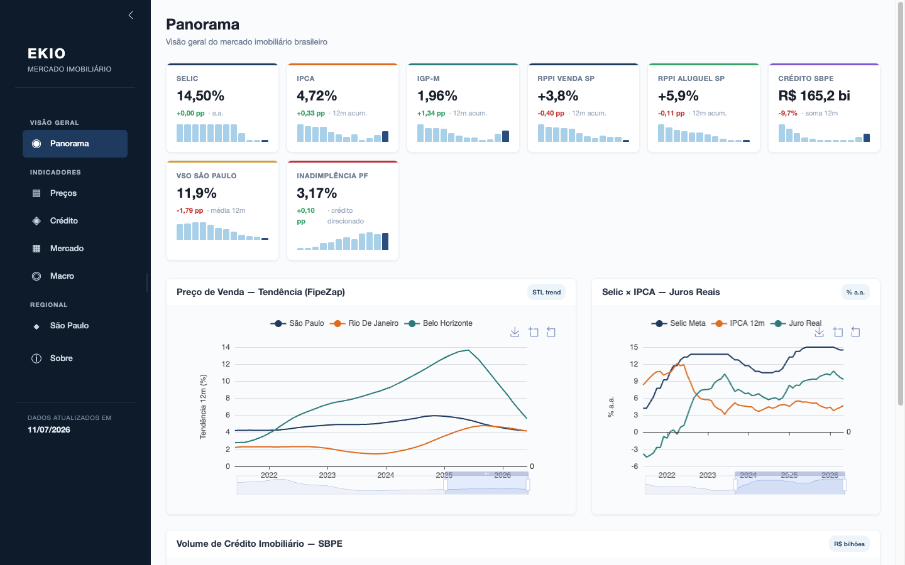
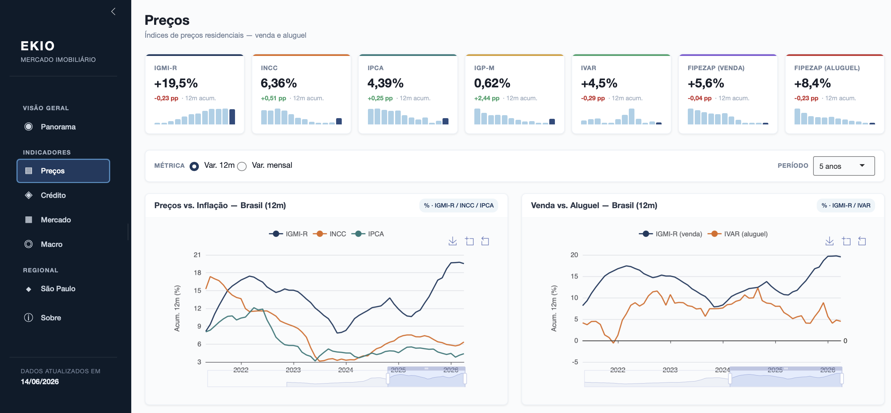

# Painel do Mercado Imobiliário

[](LICENSE)
[](https://www.r-project.org/)
[](https://shiny.posit.co/)

Interactive R Shiny dashboard for Brazilian residential real estate market indices — prices, credit, primary market, macro, and São Paulo housing indicators.

**Live demo:** [viniciusoike-shiny-painel-mercado.share.connect.posit.cloud](https://viniciusoike-shiny-painel-mercado.share.connect.posit.cloud)




```r
# Dependencies are pinned with renv; restore them on first clone
renv::restore()

# Launch the app
shiny::runApp()
```

`renv::restore()` installs the exact versions in `renv.lock`. To set up manually instead:

```r
install.packages(c("shiny", "bslib", "brand.yml", "echarts4r", "dplyr",
                   "tidyr", "lubridate", "here", "jsonlite", "curl",
                   "realestatebr"))
```

Network access is required on first run to fetch market data. Subsequent runs use the local cache under `.cache/`.

## Deployment

The app is **read-only over a pre-warmed cache** — it never refetches at runtime, so it deploys cleanly and stays stateless. It's hosted on **Posit Connect Cloud, linked directly to this GitHub repo**: Connect Cloud deploys straight from the repo's current commit, with no build step, so the pre-warmed data has to be committed to git. `load_dataset()` reads the gitignored `.cache/` first (local dev), then falls back to the git-tracked `data-cache/` seed.

To publish fresh data:

```r
Rscript tools/prewarm.R   # update every dataset, refresh .cache/ and data-cache/
```

```sh
git add data-cache && git commit -m "Refresh data cache" && git push
```

The push both ships the new data and triggers Connect Cloud's auto-redeploy. `.github/workflows/refresh-data.yml` does this on a weekly schedule automatically (plus manual `workflow_dispatch`).

Deploying to a traditional Posit Connect server instead? `Rscript tools/deploy.R` bundles `.cache/*.rds` via `rsconnect::deployApp()` with an explicit `appFiles` list (dev-only files excluded).

## Data Sources

All data comes from [`realestatebr`](https://github.com/viniciusoike/realestatebr) via a small dataset registry in `R/_setup.R` (`load_dataset(name)`, cached per dataset under `.cache/`):

## Dashboard Sections

| Tab | Contents |
|---|---|
| **Panorama** | Executive summary — Selic × IPCA real rate, SBPE credit volume, FipeZap city trends, 8 KPI cards with sparklines |
| **Preços** | Nation and city-level price indices (IGMI-R, INCC, IPCA, IGP-M, IVAR, FipeZap), STL trend overlay, real vs. nominal, yearly accumulation |
| **Crédito** | SBPE credit volume and units, financing rate, delinquency (Abecip / BCB) |
| **Mercado** | Primary market launches, sales, supply, distratos, deliveries, VGV by segment (Abrainc) |
| **Macro** | Selic, IPCA, IGP-M, INCC, real interest rate, debt burden, delinquency (BCB) |
| **São Paulo** | Secovi-SP: launches vs. sales, VSO, supply, VGV, months of inventory, dormitório composition |
